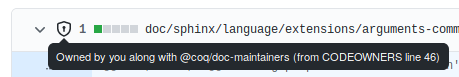

# Guide to contributing to Rocq #

## Foreword ##

As with any documentation, this guide is most useful if it's promptly
updated to reflect changes in processes, development tools, or the Rocq
ecosystem.  If you notice anything inaccurate or outdated, please
signal it in a new issue, or fix it in a new pull request.  If you
find some parts are not sufficiently clear, you may open an issue as
well.

## Table of contents ##

- [Guide to contributing to Rocq](#guide-to-contributing-to-coq)
  - [Foreword](#foreword)
  - [Table of contents](#table-of-contents)
  - [Introduction](#introduction)
  - [Contributing to the ecosystem](#contributing-to-the-ecosystem)
    - [Asking and answering questions](#asking-and-answering-questions)
    - [Writing tutorials and blog posts](#writing-tutorials-and-blog-posts)
    - [Contributing to the wiki](#contributing-to-the-wiki)
    - [Creating and maintaining Rocq packages](#creating-and-maintaining-coq-packages)
      - [Distribution of Rocq packages](#distribution-of-coq-packages)
      - [Support for plugin and library authors](#support-for-plugin-and-library-authors)
      - [Standard libraries](#standard-libraries)
      - [Maintaining existing packages in coq-community](#maintaining-existing-packages-in-coq-community)
    - [Contributing to the editor support packages](#contributing-to-the-editor-support-packages)
    - [Contributing to the website or the package archive](#contributing-to-the-website-or-the-package-archive)
    - [Other ways of creating content](#other-ways-of-creating-content)
  - [Issues](#issues)
    - [Reporting a bug, requesting an enhancement](#reporting-a-bug-requesting-an-enhancement)
    - [Beta testing](#beta-testing)
    - [Helping triage existing issues](#helping-triage-existing-issues)
  - [Code changes](#code-changes)
    - [Using GitHub pull requests](#using-github-pull-requests)
      - [Fixing bugs and performing small changes](#fixing-bugs-and-performing-small-changes)
      - [Proposing large changes: RFCs](#proposing-large-changes-rocq-rfcs)
      - [Seeking early feedback on work-in-progress](#seeking-early-feedback-on-work-in-progress)
    - [Taking feedback into account](#taking-feedback-into-account)
      - [Understanding automatic feedback](#understanding-automatic-feedback)
        - [Test-suite failures](#test-suite-failures)
        - [Linter failures](#linter-failures)
        - [Plugin failures](#plugin-failures)
        - [Library failures](#library-failures)
      - [Understanding reviewers' feedback](#understanding-reviewers-feedback)
      - [Fixing your branch](#fixing-your-branch)
    - [Improving the official documentation](#improving-the-official-documentation)
  - [Becoming a maintainer](#becoming-a-maintainer)
    - [Reviewing pull requests](#reviewing-pull-requests)
      - [Collaborating on a pull request](#collaborating-on-a-pull-request)
    - [Merging pull requests](#merging-pull-requests)
      - [Additional notes for pull request reviewers and assignees](#additional-notes-for-pull-request-reviewers-and-assignees)
      - [Joining / leaving maintainer teams](#joining--leaving-maintainer-teams)
    - [Core development team](#core-development-team)
  - [Release management](#release-management)
    - [Packaging Rocq](#packaging-coq)
  - [Additional resources](#additional-resources)
    - [Developer documentation](#developer-documentation)
      - [Where to find the resources](#where-to-find-the-resources)
      - [Building Rocq](#building-rocq)
      - [Continuous integration](#continuous-integration)
        - [Restarting failed jobs](#restarting-failed-jobs)
      - [Code owners, issue and pull request templates](#code-owners-issue-and-pull-request-templates)
      - [Style guide](#style-guide)
      - [OCaml resources](#ocaml-resources)
      - [Git documentation, tips and tricks](#git-documentation-tips-and-tricks)
      - [GitHub documentation, tips and tricks](#github-documentation-tips-and-tricks)
        - [Watching the repository](#watching-the-repository)
        - [Draft pull requests](#draft-pull-requests)
          - [Turning a PR into draft mode](#turning-a-pr-into-draft-mode)
      - [GitLab documentation, tips and tricks](#gitlab-documentation-tips-and-tricks)
      - [Merge script dependencies](#merge-script-dependencies)
      - [Coqbot](#coqbot)
    - [Online forum and chat to talk to developers](#online-forum-and-chat-to-talk-to-developers)
    - [Rocq calls](#rocq-calls)
    - [Rocq remote working groups](#rocq-remote-working-groups)
    - [Rocq Users and Developers Workshops](#rocq-users-and-developers-workshops)

## Introduction ##

Thank you for your interest in contributing to Rocq!  There are many
ways to contribute, and we appreciate all of them.

People often begin by making small contributions, and contributions to
the ecosystem, before working their way up incrementally to the core
parts of the system, and start to propose larger changes, or take an
active role in maintaining the system.  So this is the way this
contributing guide is organized.  However, it is by no means necessary
that you go through these steps in this order.  Feel free to use this
guide as a reference and quickly jump to the part that is most
relevant to you at the current time.

We want to make sure that contributing to Rocq is a fun and positive
experience for everyone, so please make sure you read and abide by our
[Code of Conduct][Code-of-conduct].

## Contributing to the ecosystem ##

In this section, we present all the ways to contribute to Rocq outside
of the Rocq repository itself.

### Asking and answering questions ###

One very important way of contributing is by asking and answering
questions, in order to create a body of easily-browsable,
problem-oriented, additional documentation.

There are many platforms for this purpose:

- Our [Zulip chat][Zulip], which contains a main "#Coq users" stream,
  but also many other streams dedicated to specific Rocq packages, such
  as Equations, MathComp, etc.
- Our [Discourse forum][Discourse], which contains a main "Using Coq"
  category, but also categories dedicated to asking questions in other
  languages than English. They have yet to find their public, so do not
  hesitate to advertise them to people you know who might not be at
  ease with English.
- The [Proof Assistants Stack Exchange][Proof-Assistants-SE], a Q&A
  site for users of proof assistants, including Rocq.
- Other [Stack Exchange][Stack-Exchange] sites, and particularly
  [Stack Overflow][Stack-Overflow], receive questions about Rocq.
  Questions asked anywhere on Stack Exchange with the `coq` tag are
  automatically relayed to Zulip in a [dedicated topic][Stack-Exchange-to-Zulip].

Other active places to answer questions include the [Coq-Club][]
mailing list, the [Coq IRC channel][IRC], the
[/r/Coq subreddit][Reddit], etc.

### Writing tutorials and blog posts ###

Writing about Rocq, in the form of tutorials or blog posts, is also a
very important contribution.  In particular, it can help new users get
interested in Rocq, and learn about it, and existing users learn about
advance features.  Our official resources, such as the [reference
manual][refman] are not suited for learning Rocq, but serve as
reference documentation to which you can link from your tutorials.

The Rocq website has a page listing known
[tutorials][Rocq-documentation] and the [wiki][] home page contains a
list too.  You can expand the former through a pull request on the
[Rocq website repository][Rocq-website-repository], while the latter can
be edited directly by anyone with a GitHub account.

At the current time, we do not have a way of aggregating blog posts on
a single page (like [OCaml planet][OCaml-planet]), but this would
probably be something useful to get, so do not hesitate if you want to
create it.  Some people use [Reddit][] for this purpose.

### Contributing to the wiki ###

Rocq's [wiki][] is an informal source of additional documentation which
anyone with a GitHub account can edit directly.  In particular, it
contains the Rocq [FAQ][] which has not seen so many updates in the
recent years.  You should feel free to fix it, expand it, and even
refactor it (if you are not sure if some changes would be welcome, you
can open an issue to discuss them before performing them).

People who watch the Rocq repository will see recent wiki edits in
their GitHub feed.  It is recommended to review them *a posteriori* to
check no mistake was introduced.  The wiki is also a standard git
repository, so people can follow the changes using any standard git
tool.

Rocq's wiki is formatted using GitHub's flavored Markdown, with some
wiki-specific extensions.  See:

- [GitHub's Markdown guide][GitHub-markdown]
- [GitHub's wiki extensions][GitHub-wiki-extensions]

### Creating and maintaining Rocq packages ###

*Note: this sub-section is about packages extending Rocq, such as
plugins or libraries.  A different, but also very valuable,
contribution is to package Rocq for your preferred package manager (see
[Packaging Rocq](#packaging-rocq)).*

Sharing reusable assets in the form of new libraries, plugins, and
tools is great so that others can start building new things on top.
Having an extensive and healthy package ecosystem is key to the
success of Rocq.

#### Distribution of Rocq packages ####

You can distribute your library or plugin through the [Rocq package
index][Rocq-package-index]. Important packages and tools can be advertised on the [Awesome Coq][Awesome-Coq] list. Some packages are
distributed along Rocq, within the [Rocq Platform][Rocq-Platform]. Check
the Platform's charter if you consider adding your package to it.

#### Support for plugin and library authors ####

You can find advice and best practices about maintaining a Rocq project
on the [coq-community wiki][coq-community-wiki].

Learn how to write a Rocq plugin, and about best practices, in the Rocq
[plugin tutorial][plugin-tutorial].  This tutorial is still a work in
progress, so do not hesitate to expand it, or ask questions.

If you want quick feedback on best practices, or how to talk to the
Rocq API, a good place to hang out is the [Coq devs & plugin devs
stream][Zulip-dev] of our Zulip chat.

Finally, we strongly encourage authors of plugins to submit their
plugins to join Rocq's continuous integration (CI) early on.  Indeed,
the Rocq API gets continuously reworked, so this is the best way of
ensuring your plugin stays compatible with new Rocq versions, as this
means Rocq developers will fix your plugin for you.  Learn more about
this in the [CI README (user part)][CI-README-users].

Pure Rocq libraries are also welcome to join Rocq's CI, especially if
they test underused / undertested features.

#### Standard libraries ####

There are many general purpose Rocq libraries, so before you publish
yours, consider whether you could contribute to an existing one
instead (either the official [standard
library][standard-library], or one of the many
[alternative standard libraries][other-standard-libraries]).

#### Maintaining existing packages in coq-community ####

Some Rocq packages are not maintained by their initial authors anymore
(for instance if they've moved on to new jobs or new projects) even if
they were useful, or interesting.  The coq-community organization is a
place for volunteers to take over the maintenance of such packages.

If you want to contribute by becoming a maintainer, there is [a list
of packages waiting for a
maintainer][coq-community-maintainer-wanted].  You can also propose a
package that is not listed.  Find out more about coq-community in [the
manifesto's README][coq-community-manifesto].

### Contributing to the editor support packages ###

Besides CoqIDE, whose sources are available in this repository, and to
which you are welcome to contribute, there are a number of alternative
user interfaces for Rocq, more often as an editor support package.

Here are the URLs of the repositories of the various editor support
packages:

- Proof-General (Emacs major mode) <https://github.com/ProofGeneral/PG>
- Company-coq (Emacs minor mode) <https://github.com/cpitclaudel/company-coq>
- Coqtail (Vim) <https://github.com/whonore/Coqtail>
- VsCoq Reloaded (VsCode) <https://github.com/coq-community/vscoq>

And here are alternative user interfaces to be run in the web browser:

- JsCoq (Coq executed in your browser) <https://github.com/ejgallego/jscoq>
- Jupyter kernel for Coq <https://github.com/EugeneLoy/coq_jupyter/>

Each of them has their own contribution process.

### Contributing to the website or the package archive ###

The website and the package archive have their own repositories:

- <https://github.com/coq/www>
- <https://github.com/coq/opam-coq-archive>

You can contribute to them by using issues and pull requests on these
repositories.  These repositories should get their own contributing
guides, but they don't have any at the time of writing this.

### Other ways of creating content ###

There are many other ways of creating content and making the Rocq
community thrive, including many which we might not have thought
about.  Feel free to add more references / ideas to this sub-section.

You can tweet about Rocq, you can give talks about Rocq both in
academic, and in non-academic venues (such as developer conferences).

[Codewars][] is a platform where people can try to solve some
programming challenges that were proposed by other community members.
Rocq is supported and the community is eager to get more challenges.

## Issues ##

### Reporting a bug, requesting an enhancement ###

Bug reports are enormously useful to identify issues with Rocq; we
can't fix what we don't know about.  To report a bug, please open an
issue in the [Rocq issue tracker][Rocq-issue-tracker] (you'll need a
GitHub account).  You can file a bug for any of the following:

- An anomaly. These are always considered bugs, so Rocq will even ask
  you to file a bug report!
- An error you didn't expect. If you're not sure whether it's a bug or
  intentional, feel free to file a bug anyway. We may want to improve
  the documentation or error message.
- Missing or incorrect documentation.  It's helpful to track where the
  documentation should be improved, so please file a bug if you can't
  find or don't understand some bit of documentation.
- An error message that wasn't as helpful as you'd like. Bonus points
  for suggesting what information would have helped you.
- Bugs in CoqIDE should also be filed in the [Rocq issue
  tracker][Rocq-issue-tracker].  Bugs in the Emacs plugin should be
  filed against [ProofGeneral][ProofGeneral-issues], or against
  [company-coq][company-coq-issues] if they are specific to
  company-coq features.

It would help if you search the existing issues before reporting a
bug. This can be difficult, so consider it extra credit.  We don't
mind duplicate bug reports.  If unsure, you are always very welcome to
ask on our [Discourse forum][Discourse] or [Zulip chat][Zulip]
before, after, or while writing a bug report.

It is better if you can test that your bug is still present in the
current testing or development version of Rocq (see the [next
sub-section](#beta-testing)) before reporting it, but if you can't, it
should not discourage you from reporting it.

When it applies, it's extremely helpful for bug reports to include sample
code, and much better if the code is self-contained and complete. It's not
necessary to minimize your bug or identify precisely where the issue is,
since someone else can often do this if you include a complete example. We
tend to include the code in the bug description itself, but if you have a
very large input file then you can add it as an attachment.

If you want to minimize your bug (or help minimize someone else's) for
more extra credit, then you can use the [Rocq bug
minimizer][JasonGross-coq-tools] (specifically, the bug minimizer is
the `find-bug.py` script in that repo). Nowadays, the easiest way to
use the Rocq bug minimizer is to call it through `@coqbot`, as documented
[here][coqbot-minimize].

### Beta testing ###

Rocq gets a new major release about every six months, which is then
distributed through the [Rocq Platform][Rocq-Platform].
New major versions of Rocq are first made available for beta-testing,
before being declared stable and the new default version of the Rocq
Platform. You can help make by testing the beta
version, and trying to port your projects to it.  You should report
any bug you notice, but also any change of behavior that is not
documented in the changelog.  Then Rocq developers will be able to
check if what you reported is a regression that needs to be fixed, or
an expected change that needs to be mentioned in the changelog.

You can go even further by using the development version (`master`
branch) of Rocq on a day by day basis, and report problems as soon as
you notice them.  If you wish to do so, the easiest way to install Rocq
is through opam (using the `dev` version of the Rocq package, available
in the <https://coq.inria.fr/opam/core-dev> repository) or through
[Nix][].  The documentation of the development version is [available
online][master-doc], including the [unreleased
changelog][unreleased-changelog].

### Helping triage existing issues ###

Rocq has too many bug reports for its core developers alone to manage.
You can help a lot by:

- confirming that reported bugs are still active with the current
  version of Rocq;
- determining if the bug is a regression (new, and unexpected,
  behavior from a recent Rocq version);
- more generally, by reproducing a bug, on another system,
  configuration, another version of Rocq, and by documenting what you
  did;
- giving a judgement about whether the reported behavior is really a
  bug, or is expected but just improperly documented, or expected and
  already documented;
- producing a trace if it is relevant and you know how to do it;
- producing another example exhibiting the same bug, or minimizing the
  initial example using the bug minimizer mentioned above;
- using `git bisect` to find the commit that introduced a regression;
- fixing the bug if you have an idea of how to do so (see the
  [following section](#code-changes)).

Once you have some experience with the Rocq issue tracker, you can
request to join the **@coq/contributors** team (any member of the
**@coq/core** team can give you access using [this link][add-contributor]).
Being in this team will grant you the following access:

- **Updating labels:** every open issue and pull request should
  ideally get one or several `kind:` and `part:` labels.  In
  particular, valid issues should generally get either a `kind: bug`
  (the reported behavior can indeed be considered a bug, this can be
  completed with the `kind: anomaly`, and `kind: regression` labels),
  `kind: documentation` (e.g. if a reported behavior is expected but
  improperly documented), `kind: enhancement` (a request for
  enhancement of an existing feature), or `kind: feature` label (an
  idea for a new feature).
- **Creating new labels:** if you feel a `part:` label is missing, do
  not hesitate to create it.  If you are not sure, you may discuss it
  with other contributors and developers on [Zulip][Zulip-dev] first.
- **Closing issues:** if a bug cannot be reproduced anymore, is a
  duplicate, or should not be considered a bug report in the first
  place, you should close it.  When doing so, try putting an
  appropriate `resolved:` label to indicate the reason.  If the bug
  has been fixed already, and you know in which version, you can add a
  milestone to it, even a milestone that's already closed, instead of
  a `resolved:` label.  When closing a duplicate issue, try to add all
  the additional info that could be gathered to the original issue.
- **Editing issue titles:** you may want to do so to better reflect
  the current understanding of the underlying issue.
- **Editing comments:** feel free to do so to fix typos and formatting
  only (in particular, some old comments from the Bugzilla era or
  before are not properly formatted).  You may also want to edit the
  OP's initial comment (a.k.a. body of the issue) to better reflect
  the current understanding of the issue, especially if the discussion
  is long.  If you do so, only add to the original comment, and mark
  it clearly with an `EDITED by @YourNickname:`.
- **Hiding comments:** when the discussion has become too long, this
  can be done to hide irrelevant comments (off-topic, outdated or
  resolved sub-issues).
- **Deleting things:** please don't delete any comment or issue, our
  policy doesn't allow for comments to be deleted, unless done by the
  community moderators.  You should hide them instead.  An audit log
  is available to track deleted items if needed (but does not allow
  recovering them).

However, and contrary to most other repositories, it will not give you
the ability to push new branches or tags to the repository. This is
disabled because we prefer to use forks to work on feature branches.

Yet to be fully specified: use of priority, difficulty, `help wanted`,
and `good first issue` labels, milestones, assignments, and GitHub
projects.

## Code changes ##

### Using GitHub pull requests ###

If you want to contribute a documentation update, bug fix or feature
yourself, pull requests (PRs) on the [GitHub
repository][coq-repository] are the way to contribute directly to the
Rocq implementation (all changes, even the smallest changes from core
developers, go through PRs).  You will need to create a fork of the
repository on GitHub and push your changes to a new "topic branch" in
that fork (instead of using an existing branch name like `master`).

PRs should always target the `master` branch.  Make sure that your
copy of this branch is up-to-date before starting to do your changes,
and that there are no conflicts before submitting your PR.  If you
need to fix conflicts, we generally prefer that you rebase your branch
on top of `master`, instead of creating a merge commit.

If you are not familiar with `git` or GitHub, Sections [Git
documentation, tips and tricks](#git-documentation-tips-and-tricks),
and [GitHub documentation, tips and
tricks](#github-documentation-tips-and-tricks), should be helpful (and
even if you are, you might learn a few tricks).

Once you have submitted your PR, it may take some time to get
feedback, in the form of reviews from maintainers, and test results
from our continuous integration system.  Our code owner system will
automatically request reviews from relevant maintainers.  Then, one
maintainer should self-assign the PR (if that does not happen after a
few days, feel free to ping the maintainers that were requested a
review).  The PR assignee will then become your main point of contact
for handling the PR: they should ensure that everything is in order
and merge when it is the case (you can ping them if the PR is ready
from your side but nothing happens for a few days).

After your PR is accepted and merged, it may get backported to a
release branch if appropriate, and will eventually make it to a
release.  You do not have to worry about this, it is the role of the
assignee and the release manager to do so (see Section [Release
management](#release-management)).  The milestone should give you an
indication of when to expect your change to be released (this could be
several months after your PR is merged).  That said, you can start
using the latest Rocq `master` branch to take advantage of all the new
features, improvements, and fixes.

#### Fixing bugs and performing small changes ####

Before fixing a bug, it is best to check that it was reported before:

- If it was already reported and you intend to fix it, self-assign the
  issue (if you have the permission), or leave a comment marking your
  intention to work on it (and a contributor with write-access may
  then assign the issue to you).

- If the issue already has an assignee, you should check with them if
  they still intend to work on it.  If the assignment is several
  weeks, months, or even years (!) old, there are good chances that it
  does not reflect their current priorities.

- If the bug has not been reported before, it can be a good idea to
  open an issue about it, while stating that you are preparing a fix.
  The issue can be the place to discuss about the bug itself while the
  PR will be the place to discuss your proposed fix.

It is generally a good idea to add a regression test to the
test-suite. See the test-suite [README][test-suite-README] for how to
do so.

Small fixes do not need any documentation, or changelog update.  New,
or updated, user-facing features, and major bug fixes do.  See the
[corresponding section](#improving-the-official-documentation) for
on how to contribute to the documentation, and the README in
[`doc/changelog`][user-changelog] for how to add a changelog entry.

#### Proposing large changes: Rocq RFCs ####

Please refrain to open very large PRs without discussing them first.
Indeed, you should be aware that the larger the change, the higher
the chances it will take very long to review, and possibly never get
merged.

So it is recommended that before spending a lot of time coding, you
seek feedback from maintainers to see if your change would be
supported, and if they have recommendations about its implementation.
You can do this informally by opening an issue, or more formally by
producing a design document as a [RFCs][RFCs].

Another recommendation is that you do not put several unrelated
changes in the same PR (even if you produced them together).  In
particular, make sure you split bug fixes into separate PRs when this
is possible.  More generally, smaller-sized PRs, or PRs changing fewer
components, are more likely to be reviewed and merged promptly.

#### Seeking early feedback on work-in-progress ####

You should always feel free to open your PR before the documentation,
changelog entry and tests are ready.  That's the purpose of the
checkboxes in the PR template which you can leave unticked.  This can
be a way of getting reviewers' approval before spending time on
writing the documentation (but you should still do it before your PR
can be merged).

If even the implementation is not ready but you are still looking for
early feedback on your code changes, please use the [draft
PR](#draft-pull-requests) mechanism.

If you are looking for feedback on the design of your change, rather
than on its implementation, then please refrain from opening a PR.
You may open an issue to start a discussion, or create a [Rocq RFC][RFCs] if you have a clear enough view of the
design to write a document about it.

### Taking feedback into account ###

#### Understanding automatic feedback ####

When you open or update a PR, you get automatically some feedback: we
have a bot whose job will be to push a branch to our GitLab mirror to
run some continuous integration (CI) tests.  The tests will run on a
commit merging your branch with the base branch, so if there is a
conflict and this merge cannot be performed automatically, the bot
will put a `needs: rebase` label, and the tests won't run.

Otherwise, a suite of tests will be run on GitLab, plus some
additional tests on GitHub Actions for Windows and macOS compatibility.

The complete suite of tests is no longer run by default to save
resources. But it is still required before merging a PR, so this is why
the bot will put a `needs: full CI` label if it has only run the
lightweight tests. If you are a member of **@coq/contributors**, you can
request a full run of the CI by putting the `request: full CI` label
before pushing to your PR branch, or by commenting
`@coqbot: run full CI` after having pushed. (In case you need to re-run
the tests, e.g., because the results are outdated, you can also request
the bot to do so by commenting `@coqbot: run full CI` or
`@coqbot: run light CI`. If you comment `@coqbot: run CI`, the bot will
decide whether to run the full or the lightweight tests based on the
presence of the `request: full CI` label.)

If a test fails on GitLab, you will see in the GitHub PR interface,
both the failure of the whole pipeline, and of the specific failed
job.  Most of these failures indicate problems that should be
addressed, but some can still be due to synchronization issues out of
your control.  In particular, if you get a failure in one of the
tested plugins but you didn't change the Rocq API, it is probably a
transient issue and you shouldn't have to worry about it.  In case of
doubt, ask the reviewers.

To re-run a specific failed job, you can use the Re-run jobs button
in the GitHub interface (if you are a member of **@coq/contributors**).
This won't create a new merge commits with the base branch, so if you
need this, you can use the `@coqbot: run ... CI` commands instead.

##### Test-suite failures #####

If you broke the test-suite, you should get many failed jobs, because
the test-suite is run multiple times in various settings.  You should
get the same failure locally by running `make test-suite`. It's
helpful to run this locally and ensure the test-suite is not broken
before submitting a PR as this will spare a lot of runtime on distant
machines.

To learn more about the test-suite, you should refer to its
[README][test-suite-README].

##### Linter failures #####

We have a linter that checks a few different things:

- **Every commit can build.** This is an important requirement to
  allow the use of `git bisect` in the future.  It should be possible
  to build every commit, and in principle even the test-suite should
  pass on every commit (but this isn't tested in CI because it would
  take too long).  A good way to test this locally is to use
  `git rebase master --exec "make check"`.
- **No tabs or end-of-line spaces on updated lines**.  We are trying
  to get rid of all tabs and all end-of-line spaces from the code base
  (except in some very special files that need them).  This checks not
  only that you didn't introduce new ones, but also that updated lines
  are clean (even if they were there before).  You can avoid worrying
  about tabs and end-of-line spaces by installing our [pre-commit git
  hook][git-hook], which will fix these issues at commit time.
  Running `./configure` once will install this hook automatically
  unless you already have a pre-commit hook installed.  If you are
  encountering these issues nonetheless, you can fix them by rebasing
  your branch with `git rebase --whitespace=fix`.
- **All files should end with a single newline**.  See the section
  [Style guide](#style-guide) for additional style recommendations.
- **Documented syntax is up-to-date**.  If you update the grammar, you
  should run `make doc_gram_rsts` to update the
  documented syntax.  You should then update the text describing the
  syntax in the documentation and commit the changes.  In some cases,
  the documented syntax is edited to make the documentation more
  readable.  In this case, you may have to edit
  `doc/tools/docgram/common.edit_mlg` to make `doc_gram_rsts` pass.
  See [doc_grammar's README][doc_gram] for details.

  Note that in the case where you added new commands or tactics, you
  will have to manually insert them in the documentation, the tool
  won't do that for you, although it should detect in most cases if you
  have forgotten to add documentation for your new command or tactic,
  or if the documentation is not consistent with the parser.
- **.opam files are up to date**. Rocq's `*.opam` files are generated
  automatically from metadata in `dune-project`. If the meta-data
  becomes out of sync, the linter will complain. This can be fixed
  doing `dune build *.opam` at the root of Rocq's repository.

You may run the linter yourself with `dev/lint-repository.sh`.

##### Plugin failures #####

If you did change the Rocq API, then you may have broken a plugin.
After ensuring that the failure comes from your change, you will have
to provide a fix to the plugin, and the PR assignee will have to
ensure that this fix is merged in the plugin simultaneously with your
PR on the Rocq repository.

If your changes to the API are not straightforward, you should also
document them in `dev/doc/changes.md`.

The [CI README (developer part)][CI-README-developers] contains more
information on how to fix plugins, test and submit your changes, and
how you can anticipate the results of the CI before opening a PR.

##### Library failures #####

Such a failure can indicate either a bug in your branch, or a breaking
change that you introduced voluntarily.  All such breaking changes
should be properly documented in the [user changelog][user-changelog].
Furthermore, a backward-compatible fix should be found, properly
documented in the changelog when non-obvious, and this fix should be
merged in the broken projects *before* your PR to the Rocq repository
can be.

Note that once the breaking change is well understood, it should not
feel like it is your role to fix every project that is affected: as
long as reviewers have approved and are ready to integrate your
breaking change, you are entitled to (politely) request project
authors / maintainers to fix the breakage on their own, or help you
fix it.  Obviously, you should leave enough time for this to happen
(you cannot expect a project maintainer to allocate time for this as
soon as you request it) and you should be ready to listen to more
feedback and reconsider the impact of your change.

If you need help figuring out why your PR is breaking a tested project,
you may consider requesting automatic minimization of the failure with
the bot. In principle, the bot should automatically propose this option
to you if it is available (it needs to detect a failure in a Rocq file
and it needs to confirm that the failure was not already present in the
base branch to propose to run the minimization process).

#### Understanding reviewers' feedback ####

The reviews you get are highly dependent on the kind of changes you
did.  In any case, you should always remember that reviewers are
friendly volunteers that do their best to help you get your changes in
(and should abide by our [Code of Conduct][Code-of-Conduct]).  But at
the same time, they try to ensure that code that is introduced or
updated is of the highest quality and will be easy to maintain in the
future, and that's why they may ask you to perform small or even large
changes.  If you need a clarification, do not hesitate to ask.

Here are a few labels that reviewers may add to your PR to track its
status.  In general, this will come in addition to comments from the
reviewers, with specific requests.

- [needs: fixing][needs-fixing] indicates the PR needs a fix, as
  discussed in the comments.
- [needs: documentation][needs-documentation] indicates the PR
  introduces changes that should be documented before it can be merged.
  This label may be used to reflect that the corresponding checkbox is
  not yet checked in the PR template (so that we don't forget when
  we intend to merge the PR).
- [needs: changelog entry][needs-changelog] indicates the PR introduces
  changes that should be documented in the [user
  changelog][user-changelog]. Similarly to the previous label, this
  may be used to reflect that the corresponding checkbox is not yet
  checked in the PR template.
- [needs: test-suite update][needs-test-suite] indicates that tests
  should be added to the test-suite / modified to ensure that the
  changes are properly tested. Similarly to the previous two labels,
  this may be used to reflect that the corresponding checkbox is not
  yet checked in the PR template.
- [needs: benchmarking][needs-benchmarking] and [needs: testing][needs-testing]
  indicate the PR needs testing beyond what the test suite can handle.
  For example, performance benchmarking is currently performed with a different
  infrastructure ([documented in the wiki][Benchmarking]). Unless some followup
  is specifically requested, you aren't expected to do this additional testing.

More generally, such labels should come with a description that should
allow you to understand what they mean.

#### Fixing your branch ####

If you have changes to perform before your PR can be merged, you might
want to do them in separate commits at first to ease the reviewers'
task, but we generally appreciate that they are squashed with the
commits that they fix before merging.  This is especially true of
commits fixing previously introduced bugs or failures.

### Improving the official documentation ###

The documentation is usually a good place to start contributing,
because you can get used to the pull request submitting and review
process, without needing to learn about the code source of Rocq at the
same time.

The official documentation is formed of two components:

- the [reference manual][refman],
- the [documentation of the prelude][stdlib-doc].

The sources of the reference manual are located in the
[`doc/sphinx`][refman-sources] directory.  They are written in rst
(Sphinx) format with some Rocq-specific extensions, which are
documented in the [README][refman-README] in the above directory.
This README was written to be read from begin to end.  As soon as your
edits to the documentation are more than changing the textual content,
we strongly encourage you to read this document.

The documentation of the prelude is generated with
[coqdoc][coqdoc-documentation] from the comments in the sources of the
standard library.

The [README in the `doc` directory][doc-README] contains more
information about the documentation's build dependencies, and the
`make` targets.

You can browse through the list of open documentation issues using the
[kind: documentation][kind-documentation] label, or the [user
documentation GitHub project][documentation-github-project] (you can
look in particular at the "Writing" and "Fixing" columns).

## Becoming a maintainer ##

### Reviewing pull requests ###

You can start reviewing PRs as soon as you feel comfortable doing so
(anyone can review anything, although some designated reviewers
will have to give a final approval before a PR can be merged, as is
explained in the next sub-section).

Reviewers should ensure that the code that is changed or introduced is
in good shape and will not be a burden to maintain, is unlikely to
break anything, or the compatibility-breakage has been identified and
validated, includes documentation, changelog entries, and test files
when necessary.  Reviewers can use `needs:` labels, or change requests
to further emphasize what remains to be changed before they can approve
the PR.  Once reviewers are satisfied (regarding the part they
reviewed), they should formally approve the PR, possibly stating what
they reviewed.

That being said, reviewers should also make sure that they do not make
the contributing process harder than necessary: they should make it
clear which comments are really required to perform before approving,
and which are just suggestions.  They should strive to reduce the
number of rounds of feedback that are needed by posting most of their
comments at the same time.  If they are opposed to the change, they
should clearly say so from the beginning to avoid the contributor
spending time in vain. They should avoid making nitpick comments when
in fact, they have larger concerns that should be addressed first
(these larger concerns should then be made very clear).

Furthermore, when reviewing a first contribution (GitHub highlights
first-time contributors), be extra careful to be welcoming, whatever
the decision on the PR is. When approving a PR, consider thanking the
newcomer for their contribution, even if it is a very small one (in
cases where, if the PR had come from a regular contributor, it would
have felt OK to just merge it without comment). When rejecting a PR,
take some extra steps to explain the reasons, so that it doesn't feel
hurtful. Don't hesitate to still thank the contributor and possibly
redirect them to smaller tasks that might be more appropriate for a
newcomer.

#### Collaborating on a pull request ####

Beyond making suggestions to a PR author during the review process,
you may want to collaborate further by checking out the code, making
changes, and pushing them.  There are two main ways of doing this:

- **Pull requests on pull requests:** You can checkout the PR branch
  (GitHub provides the link to the remote to pull from and the branch
  name on the top and the bottom of the PR discussion thread),
  checkout a new personal branch from there, do some changes, commit
  them, push to your fork, and open a new PR on the PR author's fork.
- **Pushing to the PR branch:** If the PR author has not unchecked the
  "Allow edit from maintainers" checkbox, and you have write-access to
  the repository (i.e. you are in the **@coq/contributors** team),
  then you can also push (and even force-push) directly to the PR
  branch, on the main author's fork.  Obviously, don't do it without
  coordinating with the PR author first (in particular, in case you
  need to force-push).

When several people have co-authored a single commit (e.g. because
someone fixed something in a commit initially authored by someone
else), this should be reflected by adding ["Co-authored-by:"
tags][GitHub-co-authored-by] at the end of the commit message.  The
line should contain the co-author name and committer e-mail address.

### Merging pull requests ###

Our [CODEOWNERS][] file associates a team of maintainers to each
component.  When a PR is opened (or a [draft PR](#draft-pull-requests)
is marked as ready for review), GitHub will automatically request
reviews to maintainer teams of affected components.  As soon as it is
the case, one available member of a team that was requested a review
should self-assign the PR, and will act as its shepherd from then on.

The PR assignee is responsible for making sure that all the proposed
changes have been reviewed by relevant maintainers (at least one
reviewer for each component that is significantly affected), that
change requests have been implemented, that CI is passing, and
eventually will be the one who merges the PR.

The PR assignee may use their own judgement to decide to merge a PR that
has not received reviews from all maintainers of affected components,
depending on how large or controversial the changes to these components
are. It is also admissible to have an assignee who is not a maintainer
of any of the affected components, in case relevant maintainers are not
available, and as long as the assignee is a member of the
**@coq/pushers** team and is able to understand the changes in the PR.

*If you have already frequently contributed to a component, we would
be happy to have you join one of the maintainer teams.* See the
[section below](#joining--leaving-maintainer-teams) on joining /
leaving maintainer teams.

The complete list of maintainer teams is available [here][coq-pushers]
(link only accessible to people who are already members of the Coq
organization, because of a limitation of GitHub).

#### Additional notes for pull request reviewers and assignees ####

- NEVER USE GITHUB'S MERGE BUTTON.  Instead, you should either:

  - post a comment containing "@coqbot: merge now";
    This is the recommended method and more convenient than the previous
    script based method (see next bullet) e.g. for developers who do not have
    a GPG key and for when you do not have access to a console.
    "coqbot" will **not** check CI status - it is expected that the merger does
    this manually upfront, but coqbot will deny the merge with an error
    response in the following cases:
    - no assignee
    - no milestone
    - no `kind` label
    - left-over `needs` labels
    - you try to merge a PR which you authored (this is decided by the
      creator of the PR - reviewers can still do minor changes and merge)

  - alternatively run the [`dev/tools/merge-pr.sh`][merge-pr] script;
    Since "coqbot" this method is deprecated with a few exceptions, like
    merges to release branches - which only release managers do.
    This requires having configured gpg with git.

- PR authors or co-authors cannot review, self-assign, or merge the PR
  they contributed to.  However, reviewers may push small fixes to the
  PR branch to facilitate the PR integration.

- PRs are merged when there is consensus.  Consensus is defined by an
  explicit approval from at least one maintainer for each component
  that is significantly affected and an absence of dissent.  As soon
  as a developer opposes a PR, it should not be merged without being
  discussed first (usually in a call or working group).

- Sometimes (especially for large or potentially controversial PRs),
  it is a good practice to announce the intent to merge, one or
  several days in advance, when unsure that everyone had a chance to
  voice their opinion, or to finish reviewing the PR.

- Only PRs targetting the `master` branch can be merged by a
  maintainer.  For PRs targetting an actively maintained release
  branch, the assignee should always be the release manager. For older
  release branches, any **@coq/core** member can merge any PR (but such
  PRs should be limited to fixing build issues).

- Before merging, the assignee must also select a milestone for the PR
  (see also Section [Release management](#release-management)).

- To know which files you are a maintainer of, you can look for black
  shields icons in the "Files changed" tab.

  

- When a PR has [overlays][user-overlays], then:

  - the overlays that are backward-compatible (normally the case for
    overlays fixing Rocq code) should have been merged *before* the PR
    can be merged; it might be a good idea to ask the PR author to
    remove the overlay information from the PR to get a fresh CI run
    and ensure that all the overlays have been merged; the PR assignee
    may also push a commit removing the overlay information (in that
    case the assignee is not considered a co-author, hence no need to
    change the assignee)

  - the overlays that are not backward-compatible (normally only the
    case for overlays fixing OCaml code) should be merged *just after*
    the PR has been merged (and thus the assignee should ping the
    maintainers of the affected projects to ask them to merge the
    overlays).

#### Joining / leaving maintainer teams ####

We are always happy to have more people involved in the PR reviewing
and merging process, so do not hesitate to propose yourself if you
already have experience on a component.

Maintainers can leave teams at any time (and core members can also
join any team where they feel able to help) but you should always
announce it to other maintainers when you do join or leave a team.

### Core development team ###

The core developers are the active developers with a lengthy and
significant contribution track record.  They are the ones with admin
powers over the Coq organization, and the ones who take part in
[votes][voting-process]
in case of conflicts to take a decision (rare).  One of them is
designated as a development coordinator, and has to approve the
changes in the core team membership (until we get a more formal
joining and leaving process).

The core developers are the members of the **@coq/core** team ([member
list][coq-core] only visible to the Coq organization members because
of a limitation of GitHub). They are also listed on the
[Coq Team page][coq-team].

## Release management ##

Rocq's major release cycles generally span about six months, with about
4-5 months of development, and 1-2 months of stabilization /
release candidates.  The release manager (RM) role is a rolling position
among core developers.  The [release plan][release-plan] is published
on the wiki.

Development of new features, refactorings, deprecations and clean-ups
always happens on `master`.  Stabilization starts by branching
(creating a new `v...` release branch from the current `master`), which
marks the beginning of a feature freeze (new features will continue to
be merged into `master` but won't make it for the upcoming major
release, but only for the next one).

After branching, most changes are introduced in the release branch by a
backporting process.  PR authors and assignee can signal a desire to
have a PR backported by selecting an appropriate milestone.  Most of
the time, the choice of milestone is between two options: the next
major version that has yet to branch from `master`, or the next
version (rc, final, or patch-level release) of the active release
branch.  In the end, it is the RM who decides whether to follow or not
the recommendation of the PR assignee, and who backports PRs to the
release branch.

Very specific changes that are only relevant for the release branch and
not for the `master` branch can result in a PR targetting the release
branch instead of `master`.  In this case, the RM is the only one who
can merge the PR, and they may even do so if they are the author of
the PR.  Examples of such PRs include bug fixes to a feature that has
been removed in `master`, and PRs from the RM changing the version
number in preparation for the next release.

Some automation is in place to help the RM in their task: a GitHub
project is created at branching time to manage PRs to backport; when a
PR is merged in a milestone corresponding to the release branch, our
bot will add this PR in a "Request inclusion" column in this project;
the RM can browse through the list of PRs waiting to be backported in
this column, possibly reject some of them by simply removing the PR
from the column (in which case, the bot will update the PR milestone),
and proceed to backport others; when a backported PR is pushed to the
release branch, the bot moves the PR from the "Request inclusion"
column to a "Shipped" column.

More information about the RM tasks can be found in the [release
process checklist][RM-checklist].

### Packaging Rocq ###

The RM role does not include the task of making Rocq available through
the various package managers out there: several contributors (most
often external to the development team) take care of this, and we
thank them for this.  If your preferred package manager does not
include Rocq, it is a very worthy contribution to make it available
there.  But be careful not to let a package get outdated, as this
could lead some users to install an outdated version of Rocq without
even being aware of it. Beyond packaging Rocq, you might want to
consider packaging the rest of Rocq packages available to users through
the [Rocq Platform][Rocq-Platform]. In this case, it would be helpful if
you try to favor the same versions as in the Rocq Platform.

This [Repology page][repology-coq] lists the versions of Rocq which are
packaged in many repositories, although it is missing information on
some repositories, like opam.

The Windows and macOS installers are created as part of the preparation
of the Rocq Platform.

## Additional resources ##

### Developer documentation ###

#### Where to find the resources ####

- You can find developer resources in the `dev` directory, and more
  specifically developer documentation in `dev/doc`. The
  [README][dev-README] in the `dev` directory lists what's available.

  For example, [`dev/doc/README.md`][dev-doc-README] is a beginner's
  guide to hacking Rocq, and documentation on debugging Rocq can be
  found in [`dev/doc/debugging.md`][debugging-doc].

- When it makes sense, the documentation is kept even closer to the
  sources, in README files in various directories (e.g. the test-suite
  [README][test-suite-README] or the refman [README][refman-README]).

- Documentation of the Rocq API is written directly in comments in
  `.mli` files.  You can browse it on [the Rocq website][api-doc], or
  rebuild it locally (`make apidoc`, requires `odoc` and `dune`).

- A plugin tutorial is located in
  [`doc/plugin_tutorial`][plugin-tutorial].

- The Rocq [wiki][] contains additional developer resources.

#### Building Rocq ####

The list of dependencies can be found in the first section of the
[`INSTALL.md`](INSTALL.md) file.

Rocq is built using the `dune` build system. Run `make` to get help on
the various available targets.  Additional documentation can be found
in [`dev/doc/build-system.dune.md`][dev-doc-dune], and in [the
official Dune documentation][dune-doc].

#### Continuous integration ####

Continuous integration (CI) testing is key in ensuring that the
`master` branch is kept in a well-functioning state at all times, and
that no accidental compatibility breakages are introduced.  Our CI is
quite extensive since it includes testing many external projects, some
of them taking more than an hour to compile.  However, you can get
partial results much more quickly (when our CI is not overloaded).
Nowadays, the full CI is not run by default as already explained in
[Understanding automatic feedback](#understanding-automatic-feedback).

The main documentation resources on our CI are:

- the [README for users, i.e. plugin and library authors][CI-README-users];
- the [README for developers, and contributors][CI-README-developers];
- the README of the [user-overlays][] directory.

Preparing an overlay (i.e. a patch to an external project that we test
in our CI, to make it compile with the modified version of Rocq in your
branch) is a step that everyone goes through at some point.  All you
need to know to prepare an overlay manually is in the README in the
[user-overlays][] directory.  You might want to use some additional
tooling such as the `make ci-*` targets of `Makefile.ci`, the Nix
support for getting the dependencies of the external projects (see the
README in [`dev/ci/nix`][dev-ci-nix], and the (so far undocumented)
[`dev/tools/create_overlays.sh`][dev-tools-create_overlays.sh] script.

More work is to be done on understanding how each developer proceeds
to prepare overlays, and propose a simplified and documented
procedure.

We also have a benchmarking infrastructure, which is documented [on
the wiki][Benchmarking].

##### Restarting failed jobs #####

When CI has a few failures which look spurious, restarting the
corresponding jobs is a good way to ensure this was indeed the case.
Most failed jobs can be restarted directly from the "Checks" tab on
GitHub. In case you need to restart a job on GitLab CI using the GitLab
interface, then you should sign into GitLab (this can be
done using a GitHub account) and join the
[Coq GitLab organization][GitLab-organization].

#### Code owners, issue and pull request templates ####

These files can be found in the [`.github`](.github) directory.  The
templates are particularly useful to remind contributors what
information we need for them, and, in the case of PRs, to update the
documentation, changelog, and test-suite when relevant.

GitHub now supports setting up multiple issue templates, and we could
use this to define distinct requirements for various kind of bugs,
enhancement and feature requests.

#### Style guide ####

There exists an [old style guide][old-style-guide] whose content is
still mostly relevant.  Yet to be done: extract the parts that are
most relevant, and put them in this section instead.

We don't use a code formatter at the current time, and we are
reluctant to merge changes to parts of the code that are unchanged
aside from formatting.  However, it is still a good idea if you don't
know how to format a block of code to use the formatting that
[ocamlformat][] would give

#### OCaml resources ####

You can find lots of OCaml resources on <http://ocaml.org/>, including
documentation, a Discourse forum, the package archive, etc.  You may
also want to refer to the [Dune documentation][dune-doc].

Another ressource is <https://ocamlverse.github.io/>, especially its
[community page][ocamlverse-community], which lists the various OCaml
discussion platforms.

#### Git documentation, tips and tricks ####

Lots of resources about git, the version control system, are available
on the web, starting with the [official website][git].

We recommend a setup with two configured remotes, one for the official
Rocq repository, called `upstream`, and one for your fork, called
`origin`.  Here is a way to do this for a clean clone:

``` shell
git clone https://github.com/coq/coq -o upstream
cd coq
git remote add origin git@github.com:$YOURNAME/coq
# Make sure you click the fork button on GitHub so that this repository exists
cp dev/tools/pre-commit .git/hooks/ # Setup the pre-commit hook
```

Then, if you want to prepare a fix:

``` shell
# Make sure we start from an up-to-date master
git checkout master
git pull --ff-only # If this fails, then your master branch is messy
git checkout -b my-topic-branch
# Modify some files
git add .
# Every untracked or modified file will be included in the next commit
# You can also replace the dot with an explicit list of files
git commit -m "My commit summary.

You can add more information on multiple lines,
but you need to skip a line first."
git push -u origin my-topic-branch
# Next time, you push to this branch, you can just do git push
```

When you push a new branch for the first time, GitHub gives you a link
to open a PR.

If you need to fix the last commit in your branch (typically, if your
branch has a single commit on top of `master`), you can do so with

```
git add .
git commit --amend --no-edit
```

If you need to fix another commit in your branch, or if you need to
fix a conflict with `master`, you will need to learn about `git rebase`.
GitHub provides [a short introduction][GitHub-rebase] to `git rebase`.

#### GitHub documentation, tips and tricks ####

GitHub has [extensive documentation][GitHub-doc] about everything you
can do on the platform, and tips about using `git` as well.  See in
particular, [how to configure your commit e-mail
address][GitHub-commit-email] and [how to open a PR from a
fork][GitHub-PR-from-fork].

##### Watching the repository #####

["Watching" this repository][GitHub-watching] can result in a very
large number of notifications.  We recommend you, either, [configure
your mailbox][notification-email] to handle incoming notifications
efficiently, or you read your notifications within a web browser.  You
can configure how you receive notifications in [your GitHub
settings][GitHub-notification-settings], you can use the GitHub
interface to mark as read, save for later or mute threads. Nowadays,
you have also the option to watch only part of the activity (only
issues, only PRs, only releases, etc.).

##### Draft pull requests #####

[Draft PRs][GitHub-draft-PR] are a mechanism proposed by GitHub to
open a pull request before it is ready for review.

Opening a draft PR is a way of announcing a change and seeking early
feedback without formally requesting maintainers' reviews.  Indeed,
you should avoid cluttering our maintainers' review request lists
before a change is ready on your side.

When opening a draft PR, make sure to give it a descriptive enough
title so that interested developers still notice it in their
notification feed.  You may also advertise it by talking about it in
our [developer chat][Zulip-dev].  If you know which developer would be
able to provide useful feedback to you, you may also ping them.

###### Turning a PR into draft mode ######

If a PR was opened as ready for review, but it turns out that it still
needs work, it can be transformed into a draft PR.

In this case, previous review requests won't be removed automatically.
Someone with write access to the repository should remove them
manually.  Afterwards, upon marking the PR as ready for review,
someone with write access will have to manually add the review
requests that were previously removed.

#### GitLab documentation, tips and tricks ####

We use GitLab mostly for its CI service.  The [Coq organization on
GitLab][GitLab-coq] hosts a number of CI/CD-only mirrors.  If you are
a regular contributor, you can request access to it from [the
organization page][GitLab-coq], although in most cases, you won't need
this.

GitLab too has [extensive documentation][GitLab-doc], in particular on
configuring CI.

#### Merge script dependencies ####

Nowadays, most assignees should use the `@coqbot: merge now` command
instead of the merge script. However, the merge script is still
available, and is still needed to merge PRs into release branches.

The merge script passes option `-S` to `git merge` to ensure merge
commits are signed.  Consequently, it depends on the GnuPG command
utility being installed and a GPG key being available.  Here is a
short documentation on how to use GPG, git & GitHub:
https://help.github.com/articles/signing-commits-with-gpg/.

The script depends on a few other utilities.  If you are a Nix user,
the simplest way of getting them is to run `nix-shell` first.

**Note for homebrew (MacOS) users:** it has been reported that
installing GnuPG is not out of the box.  Installing explicitly
`pinentry-mac` seems important for typing of passphrase to work
correctly (see also this [Stack Overflow Q-and-A][pinentry-mac]).

#### Coqbot ####

Our bot sources can be found at <https://github.com/coq/bot>.  Its
documentation is still a work-in-progress.

### Online forum and chat to talk to developers ###

We have a [Discourse forum][Discourse] (see in particular the [Rocq
development][Discourse-development-category] category) and a [Zulip
chat][Zulip] (see in particular the [Coq devs & plugin devs][Zulip-dev]
stream).  Feel free to join any of them and ask questions.
People are generally happy to help and very reactive.

Obviously, the issue tracker is also a good place to ask questions,
especially if the development processes are unclear, or the developer
documentation should be improved.

### Rocq calls ###

We try to gather every week for one hour through video-conference to
discuss current and urgent matters.  When longer discussions are
needed, topics are left out for the next working group.  See the
[wiki][wiki-calls] for more information about Rocq calls, as well as
notes of past ones.

### Rocq remote working groups ###

We semi-regularly (up to every month) organize remote working groups,
which can be accessed through video-conference, and are most often
live streamed on [YouTube][].  Summary notes and announcements of the
next working group can be found [on the wiki][wiki-WG]

These working groups are where important decisions are taken, most
often by consensus, but also, if it is needed, by a vote of core
developers.

### Rocq Users and Developers Workshops ###

We have an annual gathering late Spring in France where most core
developers are present, and whose objective is to help new
contributors get started with the Rocq codebase, provide help to plugin
and library authors, and more generally have fun together.

The list of past (and upcoming, when it's already planned) workshops
can be found [on the wiki][wiki-CUDW].

[add-contributor]: https://github.com/orgs/coq/teams/contributors/members?add=true
[api-doc]: https://coq.github.io/doc/master/api/
[Awesome-Coq]: https://github.com/coq-community/awesome-coq
[Benchmarking]: https://github.com/coq/coq/wiki/Benchmarking
[RFCs]: https://github.com/coq/rfcs
[CI-README-developers]: dev/ci/README-developers.md
[CI-README-users]: dev/ci/README-users.md
[Code-of-Conduct]: CODE_OF_CONDUCT.md
[CODEOWNERS]: .github/CODEOWNERS
[Codewars]: https://www.codewars.com/?language=coq
[company-coq-issues]: https://github.com/cpitclaudel/company-coq/issues
[coqbot-minimize]: https://github.com/coq/coq/wiki/Coqbot-minimize-feature
[Coq-Club]: https://sympa.inria.fr/sympa/arc/coq-club
[coq-community-maintainer-wanted]: https://github.com/coq-community/manifesto/issues?q=is%3Aissue+is%3Aopen+label%3Amaintainer-wanted
[coq-community-manifesto]: https://github.com/coq-community/manifesto
[coq-community-wiki]: https://github.com/coq-community/manifesto/wiki
[coq-core]: https://github.com/orgs/coq/teams/core/members
[coqdoc-documentation]: https://coq.inria.fr/refman/practical-tools/utilities.html#documenting-coq-files-with-coqdoc
[Rocq-documentation]: https://coq.inria.fr/documentation
[Rocq-issue-tracker]: https://github.com/coq/coq/issues
[Rocq-package-index]: https://rocq-prover.org/packages
[Rocq-Platform]: https://github.com/coq/platform
[coq-pushers]: https://github.com/orgs/coq/teams/pushers/teams
[coq-repository]: https://github.com/coq/coq
[coq-team]: https://coq.inria.fr/coq-team.html
[Rocq-website-repository]: https://github.com/coq/rocq-prover.org
[debugging-doc]: dev/doc/debugging.md
[dev-ci-nix]: dev/ci/nix/README.md
[dev-doc-README]: dev/doc/README.md
[dev-doc-dune]: dev/doc/build-system.dune.md
[dev-README]: dev/README.md
[dev-tools-create_overlays.sh]: dev/tools/create_overlays.sh
[Discourse]: https://coq.discourse.group/
[Discourse-development-category]: https://coq.discourse.group/c/coq-development
[doc_gram]: doc/tools/docgram/README.md
[doc-README]: doc/README.md
[documentation-github-project]: https://github.com/orgs/coq/projects/6
[dune-doc]: https://dune.readthedocs.io/en/latest/
[FAQ]: https://github.com/coq/coq/wiki/The-Coq-FAQ
[git]: https://git-scm.com/
[git-hook]: dev/tools/pre-commit
[GitHub-co-authored-by]: https://github.blog/2018-01-29-commit-together-with-co-authors/
[GitHub-commit-email]: https://help.github.com/en/articles/setting-your-commit-email-address-in-git
[GitHub-doc]: https://help.github.com/
[GitHub-draft-PR]: https://github.blog/2019-02-14-introducing-draft-pull-requests/
[GitHub-markdown]: https://guides.github.com/features/mastering-markdown/
[GitHub-notification-settings]: https://github.com/settings/notifications
[GitHub-PR-from-fork]: https://help.github.com/en/articles/creating-a-pull-request-from-a-fork
[GitHub-rebase]: https://help.github.com/articles/about-git-rebase/
[GitHub-watching]: https://github.com/coq/coq/subscription
[GitHub-wiki-extensions]: https://help.github.com/en/articles/editing-wiki-content
[GitLab-coq]: https://gitlab.com/coq
[GitLab-doc]: https://docs.gitlab.com/
[IRC]: irc://irc.libera.chat:6697/#coq
[GitLab-organization]: https://gitlab.com/coq
[JasonGross-coq-tools]: https://github.com/JasonGross/coq-tools
[kind-documentation]: https://github.com/coq/coq/issues?q=is%3Aopen+is%3Aissue+label%3A%22kind%3A+documentation%22
[master-doc]: https://coq.github.io/doc/master/refman/
[merge-pr]: dev/tools/merge-pr.sh
[needs-benchmarking]: https://github.com/coq/coq/labels/needs%3A%20benchmarking
[needs-changelog]: https://github.com/coq/coq/labels/needs%3A%20changelog%20entry
[needs-documentation]: https://github.com/coq/coq/labels/needs%3A%20documentation
[needs-fixing]: https://github.com/coq/coq/labels/needs%3A%20fixing
[needs-rebase]: https://github.com/coq/coq/labels/needs%3A%20rebase
[needs-testing]: https://github.com/coq/coq/labels/needs%3A%20testing
[needs-test-suite]: https://github.com/coq/coq/labels/needs%3A%20test-suite%20update
[Nix]: https://github.com/coq/coq/wiki/Nix
[notification-email]: https://blog.github.com/2017-07-18-managing-large-numbers-of-github-notifications/#prioritize-the-notifications-you-receive
[OCaml-planet]: http://ocaml.org/community/planet/
[ocamlformat]: https://github.com/ocaml-ppx/ocamlformat
[ocamlverse-community]: https://ocamlverse.github.io/content/community.html
[old-style-guide]: dev/doc/style.txt
[standard-library]: https://github.com/coq-community/stdlib
[other-standard-libraries]: https://github.com/coq/stdlib2/wiki/Other-%22standard%22-libraries
[pinentry-mac]: https://stackoverflow.com/questions/39494631/gpg-failed-to-sign-the-data-fatal-failed-to-write-commit-object-git-2-10-0
[plugin-tutorial]: doc/plugin_tutorial
[Proof-Assistants-SE]: https://proofassistants.stackexchange.com/
[ProofGeneral-issues]: https://github.com/ProofGeneral/PG/issues
[Reddit]: https://www.reddit.com/r/Coq/
[refman]: https://coq.inria.fr/distrib/current/refman/
[refman-sources]: doc/sphinx
[refman-README]: doc/sphinx/README.rst
[release-plan]: https://github.com/coq/coq/wiki/Release-Plan
[repology-coq]: https://repology.org/project/coq/versions
[RM-checklist]: dev/doc/release-process.md
[Stack-Exchange]: https://stackexchange.com/filters/299857/questions-tagged-coq-on-stackexchange-sites
[Stack-Exchange-to-Zulip]: https://coq.zulipchat.com/#narrow/stream/237977-Coq-users/topic/New.20Stack.20Exchange.20question
[Stack-Overflow]: https://stackoverflow.com/questions/tagged/coq
[stdlib-doc]: https://coq.inria.fr/stdlib/
[test-suite-README]: test-suite/README.md
[tools-website]: https://coq.inria.fr/related-tools.html
[tools-wiki]: https://github.com/coq/coq/wiki/Tools
[unreleased-changelog]: https://coq.github.io/doc/master/refman/changes.html#unreleased-changes
[user-changelog]: doc/changelog
[user-overlays]: dev/ci/user-overlays
[voting-process]: https://github.com/coq/coq/wiki/Core-Team-Voting-Process
[wiki]: https://github.com/coq/coq/wiki
[wiki-calls]: https://github.com/coq/coq/wiki/Coq-Calls
[wiki-CUDW]: https://github.com/coq/coq/wiki/CoqImplementorsWorkshop
[wiki-WG]: https://github.com/coq/coq/wiki/Coq-Working-Groups
[YouTube]: https://www.youtube.com/channel/UCbJo6gYYr0OF18x01M4THdQ
[Zulip]:  https://coq.zulipchat.com
[Zulip-dev]: https://coq.zulipchat.com/#narrow/stream/237656-Coq-devs.20.26.20plugin.20devs
