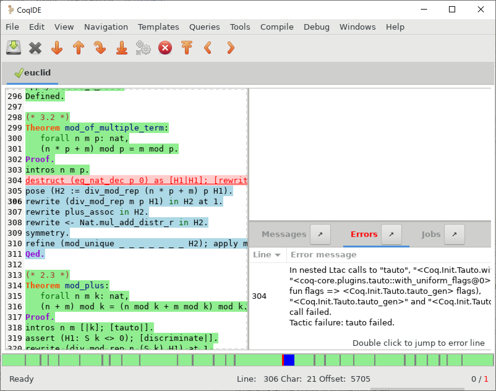
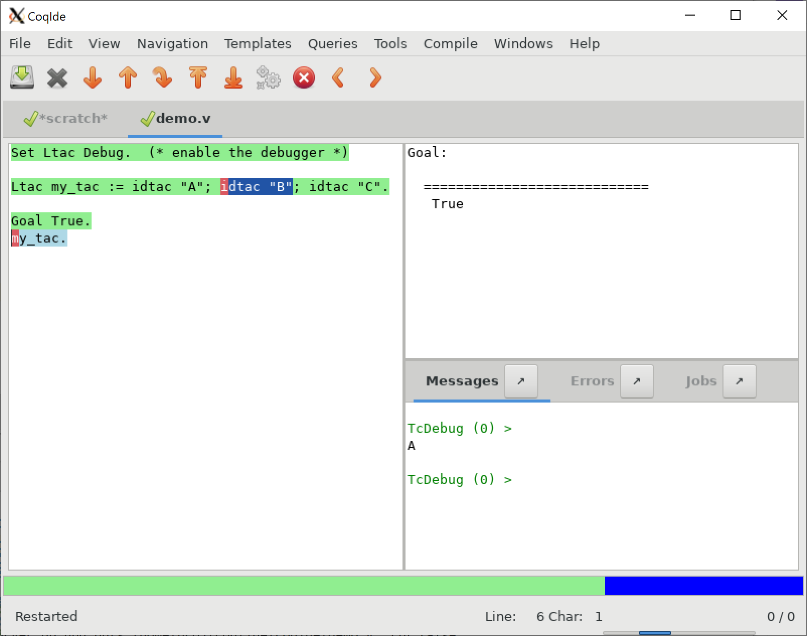

.. |GtkSourceView| replace:: :smallcaps:`GtkSourceView`

.. _coqintegrateddevelopmentenvironment:

RocqIDE
=========
.. extra =s to avoid being a git conflict marker

.. todo: how to say that a number of things are broken?  Maybe list them
   somewhere--doesn't have to be super detailed

The Rocq Integrated Development Environment (RocqIDE) is a user-friendly GUI
for Coq. Its main purpose is to allow users to edit Coq scripts and step forward
and backward through them.  Stepping forward executes commands and
tactics while stepping backward undoes previously executed commands and tactics,
returning to a previous state.

To run RocqIDE, enter `rocqide` on the command line.
If you include script file names (which end with `.v`) as arguments, each is opened
in a separate tab.  If you don't, RocqIDE opens a single unnamed buffer
(titled `*scratch*`).  `rocqide` also accepts many of the options of `rocq top`
(see :ref:`therocqcommands`), while ignoring the ones that aren't meaningful
for RocqIDE.  Use `rocqide --help` to see the list of command line options.

.. _rocqide_mainscreen:

.. image:: ../_static/rocqide.png
   :alt: RocqIDE main screen

..  Here is the code used in the screenshot:

    Fixpoint power (x n : nat) {struct n} : nat :=
      match n with
      | O => 1
      | S m => x * power x m
      end.

    Notation "x ^ n" := (power x n).

    Theorem Fermat :
      (forall x y z n : nat, x^n + y^n = z^n -> n <= 2).
    Proof.
      Induction n.

The screenshot shows RocqIDE as the user is stepping through the file `Fermat.v`.

A menu bar and a tool bar appear at the top of the window. The left-hand panel shows
the current *script buffer*.  Each script buffer corresponds to a separate Coq process.
The upper right panel is the *proof panel*, which shows the goals to be proven.

The lower right panel has four tabs:

- the *Messages panel* shows messages produced by commands and tactics;
- the *Errors panel* shows errors detected when running in :ref:`async mode <asyncmode>`;
- the *Warnings panel* shows warnings detected when running in async mode;
- the *Jobs panel* shows information on the worker processes used by async mode.

The contents of the right-hand panels are specific to the currently displayed script.
Click the arrow icons to detach these panel into separate windows.  The proof panel
can be detached with the *Windows/Detach Proof* menu item.

The *status bar* is a line of text that appears at the bottom of the window.

Managing files and buffers, basic editing
-----------------------------------------

The *File* menu lets you open files into buffers, create new buffers, save buffers to files,
and print or export them in various formats.

Text editing provides the basic operations such as copy, cut, paste, find and replace.
Most editing operations are shown in the *Edit* menu.  Keystroke equivalents (if defined)
for menu items are shown on the right of each item.  If you need more complex editor
commands, you can launch an external text editor on the current buffer, using the
*Edit/External Editor* menu. (Use `Edit/Preferences/Externals/External Editor` to
specify the external text editor.)  When you're done editing, you currently must
reopen the file to see your changes.  Also note these key bindings that are not
shown in menus:

- `Home` and `End` move the cursor to the beginning or end of the current line
  (`Cmd-Left` and `Cmd-Right` on macOS).
- `Ctrl-Home` and `Ctrl-End` move the cursor to the beginning or end of the buffer
  (`Cmd-Up` and `Cmd-Down` on macOS).
- `Ctrl-Left` and `Ctrl-Right` move the cursor to the next beginning or end of a word
- `Ctrl-Delete` (`Alt-Backspace` on macOS) and `Ctrl-Backspace` delete characters
  from the cursor to the next beginning or end of a word.

Commenting and uncommenting the current line or selected text is available in
the *Tools* menu.  If some text is selected, exactly that text is commented out;
otherwise the line containing the cursor is commented out.  To uncomment, position
the cursor between `(*` and `*)` or select any text between them.

Files are automatically saved periodically to a recovery file.  For example,
`foo.v` is saved to `#foo.v#` every 10 seconds by default.  You can change the
interval in the *Edit / Preferences / Files* dialog.  In some cases when RocqIDE
exits abruptly, it saves named buffers in ``<NAME>.crashrocqide`` in the same
directory as ``<NAME>``.  Unnamed buffers are saved in
``Unnamed_rocqscript_<N>.crashrocqide`` in the directory that RocqIDE was started in.

In the *View* menu, you can set several printing options that
correspond to options that can appear in the script.  For example, *Display
notations* on the menu corresponds to the :flag:`Printing Notations` flag.  You
should use the menu instead of controlling these settings in your script.

Running Coq scripts
-------------------

Operations for running the script are available in the *Navigation* menu,
from the toolbar and from the keyboard.  These include:

- Forward (`Alt-Down`) to run one command or tactic
- Backward (`Alt-Up`) to undo one command or tactic
- Run to cursor (`Alt-Right`) to run commands up to the cursor
- Reset Coq (`Alt-Home`) to restart the Coq process
- Run to end (`Alt-End`) to run commands to the end of the buffer
- Interrupt to stop processing commands after the current command completes.
  (Note: on Windows but not on WSL, Interrupt doesn't work if you start RocqIDE
  as a background process, e.g. `rocqide &` in bash.  See Rocq issue
  `#16142 <https://github.com/coq/coq/pull/16142>`_.)

On macOS, use `Cmd-Ctrl` instead of `Alt` for these operations.

Tooltips identify the action associated with each toolbar icon.

Commands may:

- Complete successfully.  In this case, the background of the command is marked
  with the "processed" color (green by default), except for :cmd:`Axiom`\s and
  :cmd:`Admitted`\s, which are marked in light orange to indicate they are
  unproven assumptions.
- Complete with a warning.  In this case, the warning appears in the messages
  panel in yellow.  The background of the command is marked with the "processed"
  color and the text is shown in blue and underlined.  The message text is
  available as a tooltip on the text of the command.
- Fail with an error.  If you're stepping through the proof line by line, the
  error message appears in the message panel in red and the command is shown
  in red and underlined with a pink background.  If you're in async mode,
  described in more detail below, the message appears in the *errors panel*.
  Double click on an entry to jump to the point of the error.  Execution
  of commands stops unless you're in async mode.

In the previous figure :ref:`RocqIDE main screen <rocqide_mainscreen>`,
the running buffer is `Fermat.v`.  All commands until
the ``Theorem`` have already been executed, then the user tried to go
forward executing ``Induction n``. That command failed because no such
tactic exists (names of standard tactics are written in lowercase).
The failing command has been underlined.

If you're not in async mode and you modify the processed part of the buffer,
everything after that point is undone.  Unlike in `rocq repl`, you should not use
:cmd:`Undo` to go backward.

The other buttons on the toolbar do the following:

- Open a file (folder icon)
- Save the current buffer (down arrow icon)
- Close the current buffer ("X" icon)
- Fully check the document (gears icon) - for async mode
- Previous occurrence (left arrow icon) - find the previous occurrence
  of the current word (the word under cursor)
- Next occurrence (right arrow icon) - find the next occurrence
  of the current word

The colored ribbon appearing across the bottom of the RocqIDE window just above
the status bar represents the state of processing for the current script
schematically.  Blue means unprocessed, light green means successfully
processed, red mean an error, light orange is used for :cmd:`Axiom` and :cmd:`Admitted`
and gray for proofs awaiting their final check.  Clicking on the bar moves the
script cursor to the corresponding part of the script.  (See the next screenshot,
in the async mode section.)

The left edge of the ribbon corresponds to the first command or tactic in the
script and the right edge corresponds to the last command that has been passed
to Rocq.  Currently, for very long scripts, it may take many seconds for RocqIDE to
pass all the commands to the server, causing the display to jump around a lot.  Perhaps
this will be improved in a future release.  The text at the far right hand side of
the status bar (e.g. "0 / 1" gives the number of unprocessed proofs that have been
sent to Coq and the number of proofs that have errors.

.. _asyncmode:

Asynchronous mode
-----------------

Asynchronous mode uses multiple Coq processes to process proofs
in parallel with proof-level granularity.  This is described in detail in
:ref:`asynchronousandparallelproofprocessing`.

While synchronous mode stops processing at the first error it encounters, in async
mode, errors only stop processing the proof the error appears in.
Therefore async mode can report errors in multiple proofs without manual intervention.
In addition, async mode lets the user edit failed proofs without invalidating
successful proofs that appear after it in the script.  The part of a failed proof
between `Proof.` and `Qed.` can then be edited.  Quirk: the light blue part after
the error and before `Qed.` becomes editable only after you've changed the
error-highlighted text or before it.

In the screenshot, the proof of the failed theorem can be edited (between `Proof.`
and `Qed.`) without invalidating the theorems that follow it.  The modified
proof can then be reprocessed using the usual navigation operations.  The light blue
highlight in the script indicates commands that haven't been processed.

Async mode defers the final type checking step of proofs, leaving the `Qed.` marked in
a slightly different shade of light blue to indicate this.  To complete the final
checking, click on the "gears" button on the toolbar ("Fully check the document").

Commands and templates
----------------------

The Templates menu allows using shortcuts to insert
commands. This is a nice way to proceed if you're not sure of the
syntax of the command you want.

Moreover, from this menu you can automatically insert templates of complex
commands like ``Fixpoint`` that you can conveniently fill in afterwards.

Queries
-------

.. image:: ../_static/rocqide-queries.png
   :alt: RocqIDE queries

A *query* is any command that does not change the current state, such as
:cmd:`About`, :cmd:`Check`, :cmd:`Print`, :cmd:`Search`, etc.  The *query pane*
lets you run such commands
interactively without modifying your script. The query pane is accessible from
the *View* menu, or using the shortcut ``F2``.
You can also do queries by selecting some text, then choosing an
item from the *Queries* menu. The response will appear in the message panel.
The image above shows the result after selecting
``Nat.mul`` in the bottom line of the script panel, then choosing *Print*
from the *Queries* menu.

Compilation
-----------

The *Compile* menu offers direct commands to:

+ compile the current buffer;
+ run a compilation using `make`;
+ go to the next compilation error; and
+ create a `Makefile` using `rocq makefile`.

At the moment these are not working well.  We recommend you compile
from a terminal window for now.  We expect to fix them soon.

*Compile buffer* saves the current buffer and compiles it with `rocq compile` as specified
in the *Externals* section of the *Edit/Preferences* dialog.  Output appears
in the *Messages* panel.  It's mostly useful for single-file projects because it doesn't
automatically recompile other files that it depends on that may have changed.

*Make* and *Make makefile* run the `make` and `coqmakefile` commands shown in
the *Externals* section of the *Edit/Preferences* dialog.  Output appears in the
*Messages* panel.  If you use `_CoqProject` files, you may want to change the settings to
`make -f CoqMakefile` and `coq_makefile -f _CoqProject -o CoqMakefile` as suggested
in :ref:`here <building_with_coqproject>`.  Alternatively, you may find it easier
to do your `make` and `rocq makefile` commands from the command line.

.. _rocqide_make_note:

Note that you must explicitly save changed buffers before you run `make`.
*File/Save all* is helpful for this.  Notice that modified and unmodified buffers show
different icons next to the filename on the tab.  You may find them helpful.

To use the compiled files after compiling a project with the makefile,
you must restart the Coq interpreter (using *Navigation/Start* in the
menu or `Alt-Home`) for any buffer in which you're stepping through code
that relies on the compiled files.

To make changes to `_CoqProject` take effect, you must close and reopen buffers
associated with files in the project.  Note that each buffer is independently associated
with a `_CoqProject`.  The *Project* section of the *Edit/Preferences* dialog
specifies the name to use for the `_CoqProject` file.  We recommend not changing
this.  Remember that these settings are done on a per-installation basis; they
currently can't be set differently for each package you're developing.

Customizations
--------------

Preferences
~~~~~~~~~~~

You may customize your environment with the *Preferences* dialog, which is
accessible from *Edit/Preferences* on the menu. There are several sections.

.. image:: ../_static/rocqide-preferences-editor.png
   :alt: RocqIDE preferences dialog, Editor section

The *Files* section is devoted to file management: you may configure
automatic saving of files, by periodically saving the contents into
files named `#f#` for each opened file `f`. You may also activate the
*auto reload* feature: in case an opened file is modified on disk by a
third party, RocqIDE may read it again for you. Note that in the case
you edited that same file, you will be prompted to choose to either
discard your changes or not. The File charset encoding choice is
described below in :ref:`character-encoding-saved-files`.

The *Project* section enables you to change the default name for
project files and the way that project file options are used.

The *Editor* section (shown in the screenshot above) is for
customizing the editor. It includes in particular the ability
to activate an Emacs mode named micro-Proof-General
(use the Help menu to know more about the available bindings).

The *Appearance* section offers controls to set RocqIDE's window
default size and the position of tabs.

The *Fonts* section is for selecting the text font used for scripts,
goal and message panels.

The *Colors* and *Tags* sections are for controlling colors and style of
the three main buffers. A predefined Coq highlighting style as well
as standard |GtkSourceView| styles are available. Other styles can be
added e.g. in ``$HOME/.local/share/gtksourceview-3.0/styles/`` (see
the general documentation about |GtkSourceView| for the various
possibilities). Note that the style of the rest of graphical part of
RocqIDE is not under the control of |GtkSourceView| but of GTK+ and
governed by files such as ``settings.ini`` and ``gtk.css`` in
``$XDG_CONFIG_HOME/gtk-3.0`` or files in
``$HOME/.themes/NameOfTheme/gtk-3.0``, as well as the environment
variable ``GTK_THEME`` (search the internet for the various
possibilities).

The *Externals* section allows customizing the external commands for
compilation, printing, web browsing. In the browser command, you may
use `%s` to denote the URL to open, for example:
`firefox "%s"`.

.. _shortcuts:

The *Shortcuts* section lets you change the modifiers (e.g. `Ctrl`, `Alt`
and `Shift`) used in all the menu entry key bindings for the selected menu
(for the View menu, only the checkbox items will be changed).
Current key bindings are shown at the right side of each menu entry.

If any of the new key bindings are already assigned, the existing binding
will be removed.  You can then rebind one of the menu entries as described
in the next section.

The top of the *Shortcuts* section lets you select the allowed modifiers
that can be selected for the listed menus.

*Misc* – to be documented

.. _user-configuration-directory:

Preferences and key bindings are saved in the user configuration directory,
which is ``$XDG_CONFIG_HOME/coq`` if the environment variable ``$XDG_CONFIG_HOME``
is set.  If the variable isn't set, the directory is ``~/.config/coq`` on Linux
and `C:\\Users\\<USERNAME>\\AppData\\Local\\coq` on Windows.
Preferences are in the file `coqiderc` and key bindings are in the file `coqide.keys`.

.. _rocqide_key_bindings:

.. _key_bindings:

Key bindings
~~~~~~~~~~~~

As explained just above, the *Edit/Preferences/Shortcuts* panel
offers buttons to modify in a few clicks the key bindings for a whole menu.
Here is a screenshot of the panel:

.. image:: ../_static/rocqide-preferences-shortcuts.png
   :alt: RocqIDE preferences dialog, Shortcuts section

Each menu item in the GUI shows its key binding, if one has been defined,
on the right-hand side.  Typing the key binding is equivalent to selecting
the associated item from the menu.  On some systems, you can modify the
key binding ("accelerator") for a menu entry by going to the corresponding
menu item without releasing the mouse button, pressing the keys you want
for the new binding and then releasing the mouse button.

Alternatively, you can edit the configuration file directly.
Key bindings are saved in the file `coqide.keys` in
the :ref:`user configuration directory<user-configuration-directory>`.
Make sure there are no RocqIDE processes running while you edit the file
(RocqIDE creates or overwrites the file when it terminates,
which may reorder the lines).

The file contains lines such as:

   ::

     ; (gtk_accel_path "<Actions>/Queries/About" "<Primary><Shift>a")
     ; (gtk_accel_path "<Actions>/Export/Export to" "")
     (gtk_accel_path "<Actions>/Edit/Find Next" "F4")

The first line corresponds to the menu item for the Queries/About menu item,
which was bound by default to `Shift-Ctrl-A`. `<Primary>` indicates `Cmd` on macOS
and otherwise `Ctrl`.
The second line is for a menu item that has no key binding.

Lines that begin with semicolons are comments created by RocqIDE.  RocqIDE uses
the default binding for these items.  To change a key binding, remove the semicolon
and set the third item in the list as desired, such as in the third line.
Avoid assigning the same binding to multiple items.

If the same menu item name appears on multiple lines in the file, the value from the
last line is used.  This is convenient for copying a group of changes from elsewhere–just
insert the changes at the end of the file.  The next time RocqIDE terminates, it will
resort the items.

The end of
`this file <https://github.com/linuxmint/gtk/blob/master/gdk/keyname-table.h#:~:text=NC_(%22keyboard%20label%22%2C%20%22BackSpace%22)>`_
gives the names of the keys.

Modifiers (e.g. Alt, Ctrl) for some menus can be can be changed as a group from the
Edit/Preferences/Shortcuts panel. See :ref:`Shortcuts<shortcuts>`.

.. todo: list common rebindings?

.. todo: microPG mode?

Using Unicode symbols
---------------------

RocqIDE is based on GTK+ and inherits from it support for Unicode in
its text panels. Consequently a large set of symbols is available for
notations. Furthermore, RocqIDE conveniently provides a simple way to
input Unicode characters.

Displaying Unicode symbols
~~~~~~~~~~~~~~~~~~~~~~~~~~

You just need to define suitable notations as described in the chapter
:ref:`syntax-extensions-and-notation-scopes`. For example, to use the
mathematical symbols ∀ and ∃, you may define:

.. rocqtop:: in

   Notation "∀ x .. y , P" := (forall x, .. (forall y, P) ..)
     (at level 200, x binder, y binder, right associativity)
     : type_scope.
   Notation "∃ x .. y , P" := (exists x, .. (exists y, P) ..)
     (at level 200, x binder, y binder, right associativity)
     : type_scope.

A small set of such notations are already defined in the Coq library
which you can enable with ``Require Import Unicode.Utf8`` inside RocqIDE,
or equivalently, by starting RocqIDE with ``rocqide -l utf8``.

However, there are some issues when using such Unicode symbols: you of
course need to use a character font which supports them. In the Fonts
section of the preferences, the Preview line displays some Unicode
symbols, so you could figure out if the selected font is OK. Related
to this, one thing you may need to do is choosing whether GTK+ should
use antialiased fonts or not, by setting the environment variable
`GDK_USE_XFT` to 1 or 0 respectively.

.. _rocqide-unicode:

Bindings for input of Unicode symbols
~~~~~~~~~~~~~~~~~~~~~~~~~~~~~~~~~~~~~

RocqIDE supports a builtin mechanism to input non-ASCII symbols.
For example, to input ``π``, it suffices to type ``\pi`` then press the
combination of key ``Ctrl-Space`` (default key binding). Often, it
suffices to type a prefix of the LaTeX token, e.g. typing ``\p``
then ``Ctrl-Space`` suffices to insert a ``π``.

For several symbols, ASCII art is also recognized, e.g. ``\->`` for a
right arrow, or ``\>=`` for a greater than or equal sign.

A larger number of LaTeX tokens are supported by default. The full list
is available here:
https://github.com/coq/coq/blob/master/ide/rocqide/default_bindings_src.ml

Custom bindings may be added, as explained further on.

The mechanism is active by default, but can be turned off in the Editor section
of the preferences.

.. note::

    It remains possible to input non-ASCII symbols using system-wide
    approaches independent of RocqIDE.

Adding custom bindings
~~~~~~~~~~~~~~~~~~~~~~

To extend the default set of bindings, create a file named ``coqide.bindings``
in the :ref:`user configuration directory<user-configuration-directory>`.
The file `coqide.bindings` should contain one
binding per line, in the form ``\key value``, followed by an optional priority
integer. (The key and value should not contain any space character.)

.. example::

   Here is an example configuration file:

   ::

     \par ||
     \pi π 1
     \le ≤ 1
     \lambda λ 2
     \lambdas λs

Above, the priority number 1 on ``\pi`` indicates that the prefix ``\p``
should resolve to ``\pi``, and not to something else (e.g. ``\par``).
Similarly, the above settings ensure than ``\l`` resolves to ``\le``,
and that ``\la`` resolves to ``\lambda``.

It can be useful to work with per-project binding files. For this purpose
RocqIDE accepts a command line argument of the form
``-unicode-bindings file1,file2,...,fileN``.
Each of the file tokens provided may consists of one of:

 -  a path to a custom bindings file,
 -  the token ``default``, which resolves to the default bindings file,
 -  the token ``local``, which resolves to the `coqide.bindings` file
    stored in the :ref:`user configuration directory <user-configuration-directory>`.

.. warning::

   If a filename other than the first one includes a "~" to refer
   to the home directory, it won't be expanded properly. To work around that
   issue, one should not use commas but instead repeat the flag, in the form:
   ``-unicode-bindings file1 .. -unicode-bindings fileN``.

.. note::

   If two bindings for a same token both have the same priority value
   (or both have no priority value set), then the binding considered is
   the one from the file that comes first on the command line.

.. _character-encoding-saved-files:

Character encoding for saved files
~~~~~~~~~~~~~~~~~~~~~~~~~~~~~~~~~~

In the Files section of the preferences, the encoding option is
related to the way files are saved.

If you have no need to exchange files with non-UTF-8 aware
applications, it is better to choose the UTF-8 encoding, since it
guarantees that your files will be read again without problems. (This
is because when RocqIDE reads a file, it tries to automatically detect
its character encoding.)

If you choose something else than UTF-8, then missing characters will
be written encoded by `\x{....}` or `\x{........}` where each dot is
an hexadecimal digit: the number between braces is the hexadecimal
Unicode index for the missing character.

.. _rocqide-debugger:

Debugger
--------

Version 8.15 introduces a visual debugger for |Ltac| tactics within
RocqIDE.  It supports setting breakpoints visually and automatically
displaying the stopping point in the source code with "continue",
"step over" "step in" and "step out" operations.  The call stack and variable
values for each stack frame are shown in a new panel.

The debugger is based on the non-visual |Ltac| :ref:`debugger <interactive-debugger>`.
We'd like to eventually support other scripting facilities such as Ltac2.

Since the visual debugger is new in 8.15, you may encounter bugs or usability issues.
The behavior and user interface will evolve as the debugger is refined.
There are notes on bugs and potential enhancements at the end of
`this page <https://github.com/coq/coq/wiki/Ltac-Debugger-Preview>`_.
Feel free to suggest changes and improvements by opening an issue on
`GitHub <https://github.com/coq/coq/issues/new>`_, or contact `@jfehrle`
directly through email, Zulip or Discourse.

Breakpoints
~~~~~~~~~~~

This screenshot shows the debugger stopped at a breakpoint in the |Ltac| tactic
`my_tac`.  Breakpoints are shown with a red background and the stopping point is
shown with a dark blue background.  `Set Ltac Debug.` enables stopping in the
debugger.

.. created with:
   Set Ltac Debug.  (* enable the debugger *)

   Ltac my_tac c :=
     let con := constr:(forall a b : nat,
       (a + b) * c = a * c + b * c) in
     idtac "A"; idtac "B"; idtac "C".

   Goal True.
   my_tac 2.

You can control the debugger with function and control keys.  Some
messages are shown in the Messages panel.  You can type
:ref:`debugger commands <interactive-debugger>`
in that panel when it shows the debug prompt.

The script is not editable while Coq is processing tactics or stopped
in the debugger.  When Coq is stopped in the debugger (e.g., at a breakpoint),
the blue segment in the "in progress" slider at the bottom edge of the window
will be stopped at the left hand edge of its range.

The function keys are listed, for the moment, with one exception, in the `Debug` menu:

Toggle breakpoint (F8)
  Position the cursor just before the first character of the tactic name in an Ltac
  construct, then press F8.  Press again to remove the breakpoint.  F8 is
  accepted only when all of the coqtop sessions are idle (i.e. at the debug
  prompt or not processing a tactic or command).

  Note that :term:`sentences <sentence>` containing a single built-in tactic
  are not Ltac constructs.  A breakpoint on :n:`intros.`, for example, is
  ignored, while breakpoints on either tactic in :n:`intros; idtac.` work.
  A breakpoint on, say, :n:`my_ltac_tactic.` also works.

  Breakpoints on Ltac :n:`@value_tactic`\s, which compute values without changing
  the proof context, such as :tacn:`eval`, are ignored.

  You must set at least one breakpoint in order to enter the debugger.

Continue (F9)
  Continue processing the proof.  If you're not stopped in the debugger, this is
  equivalent to "Run to end" (Alt-End).

Step over (Alt-↓)
  When stopped in the debugger,
  execute the next tactic without stopping inside it.  If the debugger reaches
  a breakpoint in the tactic, it will stop.  This is the same key combination used
  for *Forward one command*—if you're stopped in the debugger then it does a *Step over*
  and otherwise it does a *Forward*.  Combining the two functions makes it easy
  to step through a script in a natural way when some breakpoints are set.

Step in (F10)
  When stopped in the debugger, if next tactic is an |Ltac| tactic, stop at the
  first possible point in the tactic.  Otherwise acts as a "step over".

Step out (Shift-F10)
  When stopped in the debugger, continue and then
  stop at the first possible point after exiting the current |Ltac| tactic.  If the
  debugger reaches a breakpoint in the tactic, it will stop.

Break (F11)
  Stops the debugger at the next possible stopping point, from which you can
  step or continue.   (Not supported in Windows at this time.)

Note that the debugger is disabled when RocqIDE is running multiple worker processes,
i.e. running in async mode.  Going "Forward" a single step at a time doesn't use
async mode and will always enter the debugger as expected.  In addition, the debugger
doesn't work correctly in some cases involving editing failed proofs in asymc mode (
see `#16069 <https://github.com/coq/coq/pull/16069>`_.)

If you step through `idtac "A"; idtac "B"; idtac "C".`, you'll notice that the
steps for `my_tac` are:

  | `idtac "A"; idtac "B"; idtac "C"`
  | `idtac "A"; idtac "B"`
  | `idtac "A"`
  | `idtac "B"`
  | `idtac "C"`

which reflects the two-phase execution process for the :n:`@tactic ; @tactic`
construct.

Also keep in mind that |Ltac| backtracking may cause the call stack to revert to
a previous state.  This may cause confusion.  Currently there's no special
indication that this has happened.

.. unfortunately not working:
   Note: This `Wiki page <https://github.com/coq/coq/wiki/Configuration-of-CoqIDE#the-alternative-set-of-bindings>`_
   describes a way to change RocqIDE key bindings.

Call Stack and Variables
~~~~~~~~~~~~~~~~~~~~~~~~

The bottom panel shows the call stack and the variables defined for the selected
stack frame.  Stack frames normally show the name of tactic being executed, the line
number and the last component of the filename without the :n:`.v` suffix.
The directory part of the module name is shown when the frame is not in
the toplevel script file.  For example,
:n:`make_rewriter:387, AllTactics (Rewriter.Rewriter)` refers to the file
with the module name :n:`Rewriter.Rewriter.AllTactics`.

Note: A few stack frames aren't yet displayed in this described format (e.g. those starting
with :n:`???`) and may be extraneous. In some cases, the tactic name is not shown.

Click on a stack frame or press the Up (↑) or Down (↓) keys to select a
stack frame.  Coq will jump to the associated code and display the variables for that stack
frame.  You can select text with the mouse and then copy it to the clipboard with
Ctrl-C.  Ctrl-A selects the entire stack.

The variables panel uses a tree control to show variables defined in the selected
stack frame.  To see values that don't fit on a single line, click on the triangle.
You can select one or more entries from the tree in the usual way by
clicking, shift-clicking and control-clicking on an entry.  Ctrl-A selects
all entries.  Ctrl-C copies the selected entries to the clipboard.

Note: Some variable are not displayed in a useful form.  For example, the value
shown for :n:`tac` in a script containing :n:`let tac = ltac:(auto)` appears
only as :n:`<genarg:tacvalue>`.  We hope to address this soon.

The :n:`DETACH` button moves the debugger panel into a separate window, which
will make it easier to examine its contents.

Supported use cases
~~~~~~~~~~~~~~~~~~~

There are two main use cases for the debugger.  They're not very compatible.
Instead of showing warning messages or forcing the user to explicitly pick one
mode or another, for now it's up to the user to know the limitations and work within them.

The *single file* case is running the debugger on a single *primary* script without ever
stopping in other *secondary* scripts.  In this case, you can edit the primary script while
Coq is not running it nor stopped in the debugger.  The position of breakpoints will be updated
automatically as you edit the file.  It's fine to run the debugger in multiple buffers--you will not
be confused.  The single-file case is preferable when you can use it.

The *multi-file* case is when a primary script stops in a secondary script.  In this
case, breakpoints in the secondary script that move due to script editing may no longer
match the locations in the compiled secondary script.  The debugger won't stop at these
breakpoints as you expect.  Also, the code highlighted for stack frames in that
script may be incorrect.  You will need to re-compile
the secondary script and then restart the primary script (Restart, `Alt-Home`) to get back
to a consistent state.

For multi-file debugging, we suggest detaching the Messages, Proof Context
and Debugger panels so they are in separate windows.
To do so, click on the arrow icon next to *Messages*,
select *Windows / Detach Proof* from the menu and click on *DETACH* in the
Debugger panel.  Note that the Debugger panel is initially attached to
the Script panel of the toplevel script.  Also note that, for now, the
"in progress" slider is accurate only when the associated toplevel script panel
is visible.

If a debugger instance is stopped in a secondary script, the debugger function
keys are directed to the debugger instance associated with the primary script.
The debugger doesn't attempt to support multiple instances
stopped in the same secondary script.  If you have a need to do this, run
each debugger instance in a separate RocqIDE process/window.

Note that if you set a breakpoint in a script that may be called by multiple debugger
instances, you may inadvertently find you've gotten into unsupported territory.
